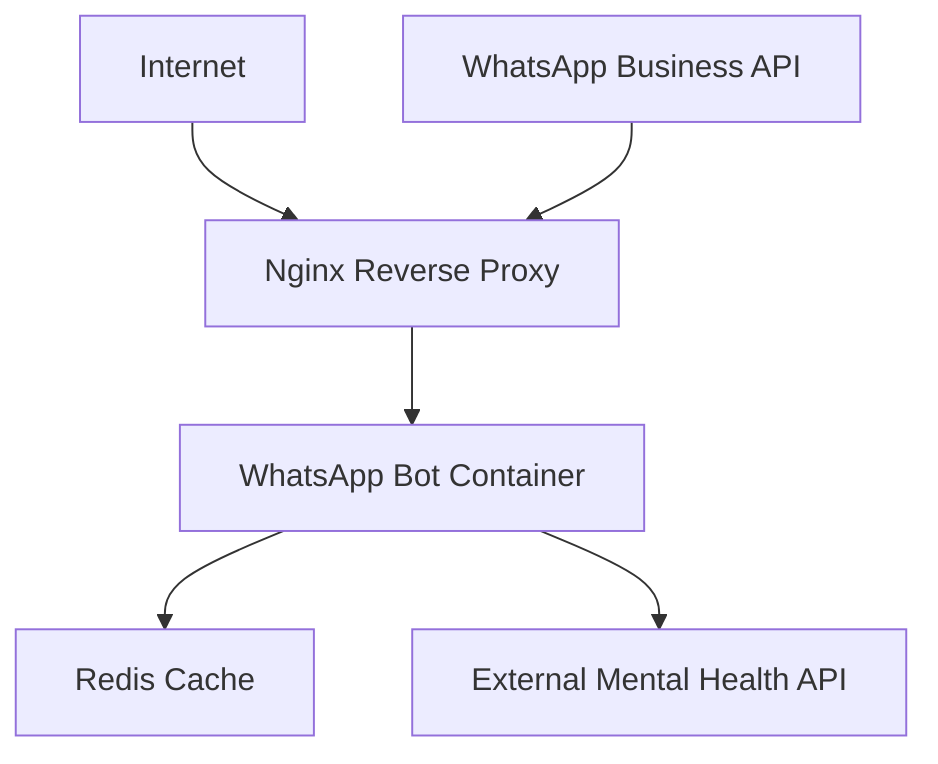

# 🐳 Docker Deployment Guide

This guide covers how to deploy the WhatsApp Mental Health Triage Bot using Docker.

## 📋 Prerequisites

- Docker Engine 20.10+ 
- Docker Compose 2.0+
- WhatsApp Business API credentials
- External API endpoint for mental health processing

## 🚀 Quick Start

### 1. **Environment Setup**

Copy the example environment file and configure your credentials:

```bash
cp env.example .env
```

Edit `.env` with your WhatsApp Business API credentials:

```bash
# Required
WHATSAPP_TOKEN=your_whatsapp_business_api_token
PHONE_NUMBER_ID=your_phone_number_id  
VERIFY_TOKEN=your_webhook_verify_token
EXTERNAL_API_URL=https://your-api-endpoint.com/process

# Optional
GRAPH_API_VERSION=v20.0
PORT=8000
```

### 2. **Development Deployment**

For development with hot reload:

```bash
# Build and run with development configuration
docker-compose -f docker-compose.dev.yml up --build

# Or run in background
docker-compose -f docker-compose.dev.yml up -d --build
```

Access the application:
- **API**: http://localhost:8000
- **Webhook**: http://localhost:8000/webhook
- **Sessions**: http://localhost:8000/sessions

### 3. **Production Deployment**

For production deployment:

```bash
# Build and run production setup
docker-compose up -d --build

# With Redis and Nginx (recommended for production)
docker-compose --profile production up -d --build
```

## 🏗️ Docker Configuration

### **Files Overview**

| File | Purpose |
|------|---------|
| `Dockerfile` | Main application container image |
| `docker-compose.yml` | Production deployment configuration |
| `docker-compose.dev.yml` | Development environment |
| `.dockerignore` | Excludes unnecessary files from build context |
| `docker-entrypoint.sh` | Container startup script with validation |
| `nginx.conf` | Reverse proxy configuration (production) |
| `env.example` | Environment variables template |

### **Container Architecture**



## 🔧 Configuration Options

### **Environment Variables**

#### **Required**
```bash
WHATSAPP_TOKEN=           # WhatsApp Business API token
PHONE_NUMBER_ID=          # Your WhatsApp phone number ID
VERIFY_TOKEN=             # Webhook verification token
EXTERNAL_API_URL=         # Mental health processing API endpoint
```

#### **Optional**
```bash
GRAPH_API_VERSION=v20.0   # WhatsApp Graph API version
PORT=8000                 # Application port
REDIS_URL=redis://redis:6379/0  # Redis connection (production)
ENABLE_METRICS=false      # Prometheus metrics
WAIT_FOR_DEPS=false       # Wait for dependencies on startup
```

### **Docker Compose Profiles**

#### **Default Profile** (Basic)
- WhatsApp Bot container only
- Suitable for development/testing

#### **Production Profile**
```bash
docker-compose --profile production up -d
```
Includes:
- WhatsApp Bot container
- Redis for session storage
- Nginx reverse proxy with SSL
- Health checks and monitoring

## 🔍 Monitoring & Debugging

### **Health Checks**

The container includes built-in health checks:

```bash
# Check container health
docker ps

# View health check logs
docker inspect --format='{{json .State.Health}}' whatsapp-mental-health-bot
```

### **Logs**

View application logs:

```bash
# Follow logs
docker-compose logs -f whatsapp-bot

# View last 100 lines
docker-compose logs --tail=100 whatsapp-bot

# Check specific container
docker logs whatsapp-mental-health-bot
```

### **Debug Endpoints**

Access these endpoints for debugging:

- `GET /sessions` - View active sessions
- `GET /sessions/{phone_number}` - Specific session details
- `DELETE /sessions/{phone_number}` - Reset session
- `GET /send-test` - Send test message

### **Container Shell Access**

Access the container for debugging:

```bash
# Enter running container
docker exec -it whatsapp-mental-health-bot bash

# Run commands inside container
docker exec whatsapp-mental-health-bot python -c "from app.config.settings import settings; print('Config loaded')"
```

## 🔒 Security Considerations

### **SSL/TLS Configuration**

For production with HTTPS:

1. **Generate SSL certificates** and place in `./ssl/` directory:
   ```bash
   mkdir ssl
   # Add your cert.pem and key.pem files
   ```

2. **Update nginx.conf** with your domain name

3. **Deploy with production profile**:
   ```bash
   docker-compose --profile production up -d
   ```

### **Security Best Practices**

- ✅ **Non-root user**: Container runs as unprivileged user
- ✅ **Secret management**: Environment variables for credentials
- ✅ **Network isolation**: Custom Docker network
- ✅ **Rate limiting**: Nginx rate limiting for webhooks
- ✅ **Health checks**: Automatic container health monitoring

## 📊 Performance Tuning

### **Resource Limits**

Add resource limits to docker-compose.yml:

```yaml
services:
  whatsapp-bot:
    deploy:
      resources:
        limits:
          cpus: '0.5'
          memory: 512M
        reservations:
          cpus: '0.25'
          memory: 256M
```

### **Scaling**

For high-volume deployments:

```bash
# Scale bot instances
docker-compose up -d --scale whatsapp-bot=3

# Use external Redis for session sharing
# Use load balancer for multiple instances
```

## 🛠️ Troubleshooting

### **Common Issues**

#### **Container Won't Start**
```bash
# Check logs
docker-compose logs whatsapp-bot

# Validate environment
docker exec whatsapp-mental-health-bot env | grep WHATSAPP
```

#### **Webhook Not Receiving Messages**
```bash
# Test webhook endpoint
curl -X GET "http://localhost:8000/webhook?hub.mode=subscribe&hub.verify_token=YOUR_TOKEN&hub.challenge=test"

# Check nginx logs (if using production profile)
docker-compose logs nginx
```

#### **Interactive Messages Not Working**
```bash
# Check WhatsApp API logs
docker-compose logs whatsapp-bot | grep INTERACTIVE

# Verify button payload format
docker exec whatsapp-mental-health-bot python -c "from app.config.messages import CONSENT_BUTTONS; print(CONSENT_BUTTONS)"
```

#### **Memory Issues**
```bash
# Monitor container resources
docker stats whatsapp-mental-health-bot

# Check for memory leaks
docker exec whatsapp-mental-health-bot python -c "import psutil; print(f'Memory: {psutil.virtual_memory().percent}%')"
```

### **Reset Everything**

To completely reset the deployment:

```bash
# Stop and remove containers
docker-compose down

# Remove volumes (loses data!)
docker-compose down -v

# Remove images
docker-compose down --rmi all

# Rebuild from scratch
docker-compose up --build
```

## 🚀 Production Deployment Checklist

- [ ] SSL certificates configured
- [ ] Environment variables set securely
- [ ] External API endpoint tested
- [ ] WhatsApp webhook configured
- [ ] Redis enabled for session storage
- [ ] Nginx reverse proxy configured
- [ ] Health checks working
- [ ] Monitoring/logging configured
- [ ] Backup strategy implemented
- [ ] Rate limiting configured
- [ ] Security headers enabled

## 📞 Support

For deployment issues:
1. Check logs: `docker-compose logs`
2. Verify environment variables
3. Test external API connectivity
4. Validate WhatsApp webhook configuration
5. Review security group/firewall settings

---

Happy containerizing! 🐳✨
