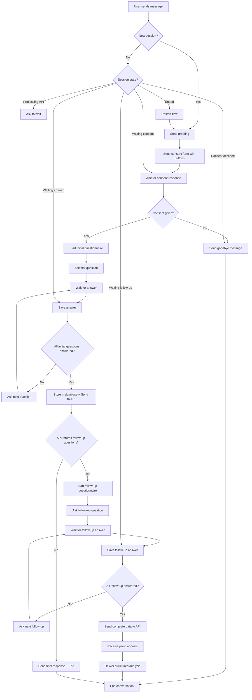

# WhatsApp Mental Health Triage Bot 🧠💬

A sophisticated conversational bot that conducts mental health triage through WhatsApp by asking predefined questions and integrating with external APIs for professional assessment.

## 🏗️ Project Structure

```
whatsapp_bot/
├── main.py                 # FastAPI application entry point
├── main_old.py            # Backup of original implementation
├── requirements.txt       # Python dependencies
├── .env                   # Environment variables (not in repo)
├── README.md             # This file
├── README_old.md         # Original README backup
└── app/                  # Main application package
    ├── __init__.py
    ├── config/           # Configuration management
    │   ├── __init__.py
    │   ├── settings.py   # Environment settings
    │   └── questions.py  # Mental health questions
    ├── models/           # Data models
    │   ├── __init__.py
    │   ├── session.py    # User session models
    │   └── question.py   # Question and answer models
    ├── services/         # Business logic services
    │   ├── __init__.py
    │   ├── whatsapp_service.py     # WhatsApp API integration
    │   ├── api_service.py          # External API service
    │   └── conversation_service.py # Conversation flow logic
    └── utils/            # Utility functions
        ├── __init__.py
        ├── session_manager.py    # Session management
        └── message_parser.py     # Message parsing utilities
```

## 🚀 Features

### Core Functionality
- **Mental Health Triage**: Conducts structured interviews with 13 specialized questions
- **Session Management**: Tracks conversation state and user progress
- **External API Integration**: Sends collected data for professional analysis
- **Dynamic Conversations**: Supports conversation continuation based on API responses
- **Robust Error Handling**: Graceful handling of API failures and edge cases

### Technical Features
- **Modular Architecture**: Clean separation of concerns with dedicated services
- **Type Safety**: Full type hints throughout the codebase
- **Async/Await**: Non-blocking operations for better performance
- **Comprehensive Logging**: Detailed request/response logging for debugging
- **RESTful API**: Debug endpoints for session management
- **Environment-based Configuration**: Secure credential management

## 🔄 Conversation Flow

### 1. **Consent Process**
When a user first contacts the bot:

1. **Greeting Message**: Welcome message
2. **Informed Consent**: Full legal consent form with:
   - Service information
   - Data treatment (Colombian Law 1581/2012)
   - Privacy & confidentiality
   - User rights
   - Service limitations
   - Consent declaration

3. **Interactive Buttons**: 
   - "Sí, acepto" (Yes, I accept)
   - "No, gracias" (No, thanks)

4. **Response Handling**:
   - **If "Yes"**: Proceed to mental health questionnaire
   - **If "No"**: Send goodbye message and end conversation

### 2. **Mental Health Questions**

After consent is given, the bot asks these triage questions:

1. **Basic Information**
   - Full name
   - Age

2. **Mental Health Assessment (Initial 9 Questions)**
   - Main concern/worry
   - Anxiety levels
   - Symptom duration
   - Relaxation difficulties
   - Depression symptoms
   - Loss of interest in activities
   - Hallucinations or psychiatric medications
   - Self-harm thoughts
   - Chronic fatigue
   - Desired outcomes
   - Specialist connection preference

### 3. **Dynamic Follow-up Process**

The bot now supports a **two-phase dynamic questioning system**:

#### **Phase 1: Initial Assessment** 
- 11 structured mental health questions (shown above)
- Data stored in database for persistence
- Sent to external API for initial analysis

#### **Phase 2: Dynamic Follow-up (API-driven)**
- API responds with 2-3 additional personalized questions
- Questions tailored to user's initial responses
- Examples:
  - "¿Cómo describirías tu estado de ánimo en el día a día?"
  - "¿Qué tan satisfecho te sientes con tus relaciones personales?"
  - "¿Qué cambiarías para aumentar tu felicidad?"

#### **Phase 3: Pre-diagnosis Delivery**
- Complete data (initial + follow-up) sent to API
- API generates comprehensive analysis:
  - **Priority Score**: Risk assessment level
  - **Pre-diagnosis**: Clinical insights
  - **Recommendations**: Actionable guidance
  - **Professional Disclaimer**: Clinical consultation advice

## ⚙️ Configuration

### Environment Variables

Create a `.env` file with:

```env
# WhatsApp Business API Configuration
WHATSAPP_TOKEN=your_whatsapp_business_api_token_here
PHONE_NUMBER_ID=your_phone_number_id_here
VERIFY_TOKEN=your_webhook_verify_token_here
GRAPH_API_VERSION=v20.0

# External API Configuration
EXTERNAL_API_URL=https://31fa51d86155.ngrok-free.app

# Database API Configuration
DATABASE_API_URL=http://18.190.66.49:8000/api/patients/intake/
DATABASE_API_TOKEN=your_database_bearer_token_here
```

### Dependencies

```bash
pip install -r requirements.txt
```

## 🔄 API Integration

### Dynamic Dual-Call Architecture

The bot employs a **sophisticated dual API approach** with **two separate API calls**:

#### **First API Call** (After Initial Questions)
1. **📊 Database Storage**: Stores initial intake data for record keeping
2. **🧠 External Processing API**: POST to `/questions` endpoint - processes initial data and returns follow-up questions

#### **Second API Call** (After Follow-up Questions)
1. **🧠 External Processing API**: POST to `/answers` endpoint - processes complete data and returns pre-diagnosis

### API Endpoints

- **🧠 Multi-Agent API Base**: `https://31fa51d86155.ngrok-free.app`
- **❓ Questions Endpoint**: `POST /questions` - Initial questionnaire processing
- **💬 Answers Endpoint**: `POST /answers` - Complete data processing and pre-diagnosis

### Request Formats

#### **Initial API Call Payload** (to `/questions`)

```json
{
  "phone_number": "+573213754760",
  "chat": [
    {
      "question": "¡Hola! 👋 Para comenzar, ¿cuál es tu nombre completo?",
      "answer": "David Test"
    },
    {
      "question": "¿Cuál es tu edad?",
      "answer": "25"
    },
    {
      "question": "¿Cuál es el motivo principal de tu preocupación?",
      "answer": "Ansiedad por trabajo"
    },
    {
      "question": "¿Te sientes nervioso, tenso o ansioso con frecuencia?",
      "answer": "Sí, frecuentemente"
    },
    {
      "question": "¿Cuánto tiempo llevas experimentando estos síntomas?",
      "answer": "2 meses"
    },
    {
      "question": "¿Estás teniendo dificultad para relajarte?",
      "answer": "Sí, mucho"
    },
    {
      "question": "¿Te sientes triste o deprimido y me puedes comentar un poco mas del contexto del porque?",
      "answer": "A veces, por el trabajo"
    },
    {
      "question": "¿Has perdido interés en actividades que antes disfrutabas? ¿Que actividades eran las que te interesaban antes y que sientes ahora cuando las haces?",
      "answer": "Sí, en algunas actividades como deportes"
    },
    {
      "question": "¿Tienes alucinaciones o estás en medicamentos psiquiátricos?",
      "answer": "No"
    },
    {
      "question": "¿Has tenido pensamientos sobre hacerte daño o acabar con tu vida?",
      "answer": "No"
    },
    {
      "question": "¿Te sientes cansado todo el tiempo sin razón aparente?",
      "answer": "Sí, constantemente"
    },
    {
      "question": "¿Qué te gustaría que pasara ahora mismo?",
      "answer": "Sentirme mejor"
    },
    {
      "question": "¿Quieres conectar ya con un especialista?",
      "answer": "Sí, por favor"
    }
  ]
}
```

#### **Follow-up API Call Payload** (to `/answers`)

```json
{
  "phone_number": "+573213754760",
  "chat": [
    {
      "question": "¡Hola! 👋 Para comenzar, ¿cuál es tu nombre completo?",
      "answer": "David Test"
    },
    {
      "question": "¿Cuál es tu edad?",
      "answer": "25"
    },
    {
      "question": "¿Cuál es el motivo principal de tu preocupación?",
      "answer": "Ansiedad por trabajo"
    },
    {
      "question": "¿Te sientes nervioso, tenso o ansioso con frecuencia?",
      "answer": "Sí, frecuentemente"
    },
    {
      "question": "¿Cuánto tiempo llevas experimentando estos síntomas?",
      "answer": "2 meses"
    },
    {
      "question": "¿Estás teniendo dificultad para relajarte?",
      "answer": "Sí, mucho"
    },
    {
      "question": "¿Te sientes triste o deprimido y me puedes comentar un poco mas del contexto del porque?",
      "answer": "A veces, por el trabajo"
    },
    {
      "question": "¿Has perdido interés en actividades que antes disfrutabas? ¿Que actividades eran las que te interesaban antes y que sientes ahora cuando las haces?",
      "answer": "Sí, en algunas actividades como deportes"
    },
    {
      "question": "¿Tienes alucinaciones o estás en medicamentos psiquiátricos?",
      "answer": "No"
    },
    {
      "question": "¿Has tenido pensamientos sobre hacerte daño o acabar con tu vida?",
      "answer": "No"
    },
    {
      "question": "¿Te sientes cansado todo el tiempo sin razón aparente?",
      "answer": "Sí, constantemente"
    },
    {
      "question": "¿Qué te gustaría que pasara ahora mismo?",
      "answer": "Sentirme mejor"
    },
    {
      "question": "¿Quieres conectar ya con un especialista?",
      "answer": "Sí, por favor"
    },
    {
      "question": "En general, ¿cómo describirías tu estado de ánimo y tus emociones en tu día a día?",
      "answer": "Me siento triste por las mañanas especialmente"
    },
    {
      "question": "Pensando en tus relaciones personales (familia, amigos, pareja), ¿qué tan satisfecho te sientes con la calidad y el apoyo que recibes?",
      "answer": "Tengo buenas relaciones familiares que me apoyan"
    },
    {
      "question": "Si pudieras cambiar algo en tu vida actual para aumentar significativamente tu felicidad, ¿qué sería?",
      "answer": "Me gustaría tener más tiempo libre y menos presión laboral"
    }
  ]
}
```

### Database Endpoint

- **URL**: `http://18.190.66.49:8000/api/patients/intake/`
- **Method**: `POST`
- **Auth**: `Bearer eyJhbGciOiJIUzI1NiIs...`
- **Purpose**: Store patient intake data for records

### Response Formats

#### **Initial API Response** (With Follow-up Questions)

```json
{
  "questions": [
    "En general, ¿cómo describirías tu estado de ánimo y tus emociones en tu día a día?",
    "Pensando en tus relaciones personales, ¿qué tan satisfecho te sientes con ellas?",
    "¿Qué cambiarías en tu vida para aumentar tu felicidad?"
  ]
}
```

#### **Final API Response** (With Pre-diagnosis)

```json
{
  "pre-diagnosis": "El usuario está experimentando un estado de ánimo persistentemente bajo, caracterizado por tristeza, decaimiento, apatía, soledad y falta de motivación.",
  "comments": "Los análisis coinciden en que el usuario se encuentra en un estado de ánimo decaído. Se recomienda buscar apoyo profesional.",
  "score": "Alta prioridad",
  "filled_doc": "Diagnóstico completo con recomendaciones detalladas..."
}
```

## 🚀 Running the Application

### 🐳 Docker (Recommended)

#### Quick Start
```bash
# Copy environment template
cp env.example .env
# Edit .env with your WhatsApp credentials

# Development
docker-compose -f docker-compose.dev.yml up --build

# Production
docker-compose up -d --build
```

#### Full Production (with Redis & Nginx)
```bash
docker-compose --profile production up -d --build
```

📖 **See [DOCKER.md](DOCKER.md) for complete Docker deployment guide**

### 🐍 Local Development

#### Prerequisites
```bash
pip install -r requirements.txt
```

#### Development
```bash
uvicorn main:app --host 0.0.0.0 --port 8000 --reload
```

#### Production
```bash
uvicorn main:app --host 0.0.0.0 --port 8000 --workers 4
```

## 🛠️ Debug Endpoints

### Session Management
- `GET /sessions` - List all active sessions
- `GET /sessions/{phone_number}` - Get detailed session info
- `DELETE /sessions/{phone_number}` - Reset a user's session

### Testing
- `GET /send-test?to={phone}&text={message}` - Send test message

### Webhook
- `GET /webhook` - Webhook verification
- `POST /webhook` - Receive WhatsApp messages

## 📊 Conversation Flow



## 🏥 Mental Health Considerations

### Critical Response Handling
- **Self-harm indicators**: Immediate escalation protocols
- **Hallucinations**: Priority flagging for clinical review
- **Severe symptoms**: Urgent referral pathways

### Privacy & Security
- **Data encryption**: All mental health data encrypted in transit
- **HIPAA compliance**: Ensure your external API meets healthcare standards
- **Audit trails**: Comprehensive logging for clinical accountability

### Clinical Integration
- **Risk stratification**: API should classify risk levels
- **Provider matching**: Connect users with appropriate specialists
- **Follow-up scheduling**: Automated appointment booking integration

## 🔧 Development

### Adding New Questions
1. Update `app/config/questions.py`
2. Modify the API payload structure if needed
3. Update documentation

### Custom Services
1. Create new service in `app/services/`
2. Add to `app/services/__init__.py`
3. Inject into main application

### Testing
```bash
# Test the conversation flow
curl "http://localhost:8000/send-test?to=YOUR_PHONE&text=test"

# Check session state
curl "http://localhost:8000/sessions/YOUR_PHONE"

# Reset if needed
curl -X DELETE "http://localhost:8000/sessions/YOUR_PHONE"
```

## 🚨 Deployment Considerations

### Production Checklist
- [ ] Use Redis/Database for session storage
- [ ] Implement rate limiting
- [ ] Set up proper logging and monitoring
- [ ] Configure SSL/TLS
- [ ] Add authentication for debug endpoints
- [ ] Set up session cleanup for inactive users
- [ ] Implement backup and recovery procedures
- [ ] Configure alerting for critical responses

### Scaling
- Use horizontal scaling with load balancers
- Implement session affinity or distributed session storage
- Monitor API response times and scale external API accordingly
- Set up auto-scaling based on message volume

## 📝 License

This project is intended for mental health triage and should be used in compliance with local healthcare regulations and professional standards.

## 🆘 Support

For technical issues or clinical integration questions, please refer to the project documentation or contact the development team.

---

**⚠️ Important**: This bot is designed for initial triage only and should not replace professional mental health assessment or emergency services.
